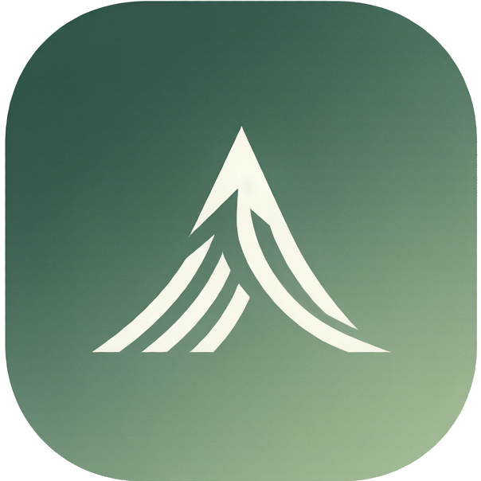

# GeoMate · 地质实习 AI 助手

<p align="center">
  
</p>

> 一个 WorkBuddy Skill：陪地质基础薄弱的大学生跑完野外实习全程——实习前消化指导书、学会工具，实习中辅助鉴定与记录，实习后整理野簿、准备发言、搭报告。

## 为什么做这个 Skill（灵感复盘）

我是中国地质大学（武汉）的一名学生，但**不是地质专业**（我学计算机）。在我们学校，很多专业都要参加地质野外实习——于是问题来了：

- 实习指导书发下来，满篇"产状、节理、不整合"，像读天书，预习无从下手
- 到了现场，罗盘根本不会用，老师要求测产状，只能干着急
- 岩石认不出来，想问又怕暴露自己是"小白"
- 老师边走边讲，语速快、内容多，笔记根本记不下来
- 回来补野簿，格式规范一头雾水，而野簿恰恰是成绩的大头

我后来发现，这些困难不是我一个人的——身边非地质专业的同学几乎都踩了一遍。这些痛点恰恰是 AI 最擅长解决的：**把专业门槛翻译成白话、把零散信息整理成规范产出、把"不好意思问"变成"随时能问"**。

于是我先做了 GeoMate 的 Web/App 版本，验证了整个工作流；这次把它重构成一个 WorkBuddy Skill——不用装 App、不用部署服务，对话里一句话就能用起来。

## 它能干什么：一条实习时间线

```
实习前                    实习中                     实习后
─────────────          ─────────────             ─────────────
指导书→预习包            拍照→岩石鉴定卡           录音→规范野簿
罗盘/放大镜教学网页       测量姿势拍照检查          地质剖面图
出发装备+安全清单                                   课堂发言问题准备
                                                 实习报告框架
```

## 使用流程

1. **首次见面**：AI 会亲切介绍实习基本步骤、提醒出野辛苦，并问两个分流问题——"有没有地质基础"（决定要不要白话解释）、"是不是地大学生"（决定野簿用不用地大六栏格式）。只问一次，随时可改。
2. **实习前**：把指导书 PDF 发给 AI，自动提取路线、知识点，生成按天学习计划+自测题；打开两个交互教学网页，十分钟学会罗盘和放大镜；出发前生成装备和安全清单。
3. **实习中**：拍到不认识的岩石发照片，AI 给鉴定卡（初判+依据+置信度+建议找老师确认）；罗盘贴上岩面拍一张，AI 检查测量姿势对不对；现场用结构化口诀录音，回去转成文字发过来。
4. **实习后**：录音文字自动整理成规范野簿（支持地大六栏：路线、任务、点位、点义、内容、路线小结），一键绘制地质剖面图；按你的水平生成课堂发言问题；最后搭好实习报告框架。

## 功能模块速查

| 模块 | 你会说的话 | 产出 |
|---|---|---|
| 指导书消化 | "帮我看看这份实习指导书" | 预习包：路线+知识点+学习计划+自测题 |
| 工具教学 | "罗盘怎么用""放大镜怎么看矿物" | 两个可交互教学网页（可离线保存） |
| 岩石鉴定 | "帮我鉴定这块石头"（发照片） | 鉴定卡：初判+四要素依据+置信度 |
| 姿势检查 | "我测产状的姿势对吗"（发照片） | 逐项纠错+原理讲解 |
| 录音转野簿 | "这段录音帮我整理成记录" | 规范野簿（地大六栏/通用格式） |
| 剖面图 | "帮我画地质剖面图" | SVG 剖面图（图名/比例尺/方向/图例/产状齐全） |
| 课堂发言 | "明天上课老师要提问" | 按你的水平定制的 3—5 个问题+回答要点 |
| 实习报告 | "实习报告怎么写" | 报告框架+素材来源清单 |
| 出发清单 | "出野要带什么" | 装备+安全清单（按路线天数定制） |

## 输出规范

- **岩石描述四要素缺一不可**：结构、构造、矿物形态、矿物特征
- **产状统一格式**：`倾向°∠倾角°`，如 `300°∠35°`
- **鉴定不做定论**：必带置信度和"建议找老师确认"，口述推断置信度封顶"中"
- **数据来源严格分离**：路线/任务来自指导书，点位/点义/内容/路线小结来自你的录音，网络查到的标【网络补充】，不确定的标【待现场确认】
- **成果永久可打开**：本地 Markdown/HTML/SVG 文件，可选同步资料库或腾讯文档

## 输入示例

- 「下周要去地质实习了，我啥也不懂怎么办」→ 首次见面引导 + 预习规划
- 「帮我看看这份实习指导书，告诉我每天要干嘛」→ 预习包
- 「罗盘到底怎么用啊」→ 交互教学网页
- 「我把老师讲的录音转成文字了，帮我整理成野簿」→ 六栏野簿
- 「这块石头是啥，肉红色、能看到黑色一片一片的」→ 鉴定卡（花岗岩方向）
- 「明天老师要提问，帮我想想能问点啥」→ 课堂发言问题

## 设计原则（也是底线）

1. **学术诚信**：不编造用户没观察到的现象和数据，宁可标【待现场确认】
2. **辅助而非替代**：鉴定是初判、问题是素材、报告是框架——学习的主体永远是学生自己
3. **零依赖可用**：核心功能无网络、无连接器、无 Python 也能跑；外部能力全是可选增强，缺失时自动降级

## 目录结构

```
geology-fieldwork-assistant/
├── SKILL.md                        技能说明书：触发、流程、风格、边界
├── skill-dependencies.json         依赖与降级清单
├── references/                     领域知识（按需加载）
│   ├── fieldwork-guide.md          实习步骤、安全须知、白话术语库、录音口述技巧
│   ├── notebook-cug.md             地大野簿六栏规范、剖面图要求、数据来源规则
│   ├── rock-description.md         岩石描述四要素规范与示例
│   ├── templates.md                预习包/报告框架/清单/课堂问题模板
│   └── setup-guide.md              可选增强配置指南
├── scripts/                        确定性工具（仅 Python 标准库）
│   ├── extract_pdf_text.py         指导书 PDF 文字提取（含中文编码映射）
│   ├── draw_profile.py             地质剖面图 SVG 绘制
│   └── check_environment.py        环境检查器
└── assets/                         交互教学网页（离线可用）
    ├── compass-tutor.html          罗盘互动教室
    └── magnifier-tutor.html        放大镜互动教室
```

## 运行环境

- 平台：WorkBuddy（用户级安装）
- Python 3.10+（仅标准库；不装也能用对话功能，PDF 提取和绘图改走降级路径）
- 可选增强：资料库、腾讯文档连接器（未连接时自动降级为本地文件）

## 版本

- v1.0.0：首次发布。经过五阶段自检（结构、安全、环境、实测、评分），11 项质量维度平均 8.8 分。

## License

仅供学习交流使用。
